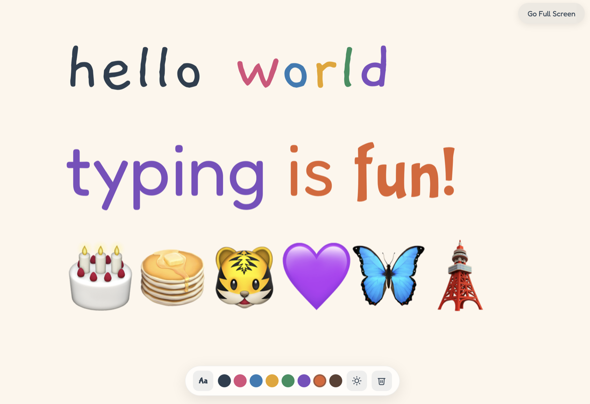

# Tiny Typer

[](https://tinytyper.pages.dev/)
[](https://pages.cloudflare.com/)
[](https://gsap.com/)
[](LICENSE)<br>
[]()

A minimal typing toy for toddlers — big bouncy letters, bright colours, and happy writing.

**[Try it live](https://tinytyper.pages.dev/)**



No build tools, no npm, no dependencies — just four static files served from a folder.

> The 2D sibling of [Tiny Fingers](https://tinyfingers.pages.dev/) ([GitHub](https://github.com/hashmil/tinyfingers)) — same idea, simpler execution.

## How it works

1. Open the app and tap **Start Full Screen** or **Start Here**
2. Press any letter or number — a big, colourful character pops onto the page
3. Press a special character key — a random emoji appears instead
4. Pick colours from the toolbar dot palette
5. Cycle fonts (Fredoka, Gaegu, Bubblegum Sans, Patrick Hand)
6. Switch themes — Paper, Space, Princess, Forest, Ocean, Sunset

## Run locally

```bash
python3 -m http.server 8000
```

Open [http://localhost:8000](http://localhost:8000) in a modern browser.

> **Note:** Opening `index.html` directly as a `file://` URL won't work due to browser CORS restrictions on ES modules.

## Architecture

Four files, zero build step:

| File | What it does |
|------|-------------|
| `index.html` | Markup for the start overlay, toolbar, typing page, and hidden mobile input |
| `style.css` | All styles — themes, responsive breakpoints, animations, toolbar |
| `editor.js` | Typing engine — character spans, font cycling, colour management, emoji substitution |
| `main.js` | App lifecycle — fullscreen, keyboard/mobile input, toolbar controls, theme switching |

### Key handling

- Letters `a-z` and digits `0-9` render as typed
- Space inserts a space
- Basic punctuation (`. , ! ?`) renders as-is
- All other special characters become a random emoji from a pool of 150+
- Backspace deletes the last character
- Enter adds a newline

### Themes

Six themes with matching colour palettes:

- **Paper** — warm cream (default)
- **Space** — deep navy with auto-switching to a bright colour palette for contrast
- **Princess** — soft pink/lavender
- **Forest** — earthy greens
- **Ocean** — light blue
- **Sunset** — warm coral

### Toddler-proofing

- Context menu, drag, and drop are disabled
- Browser shortcuts (Cmd/Ctrl) are blocked
- Pinch zoom is prevented
- Clear requires a double-tap to confirm
- Navigation away is blocked in fullscreen

## Accessibility

- Respects `prefers-reduced-motion` — letter pop animations and transitions are disabled
- Dark theme auto-swaps to high-contrast colour palette
- Device dark mode is ignored (`color-scheme: light only`) to prevent unexpected appearance changes
- All toolbar buttons meet minimum 44px touch target size

## Contributing

Contributions are welcome! Feel free to open issues or submit pull requests.

## License

[MIT](LICENSE)
